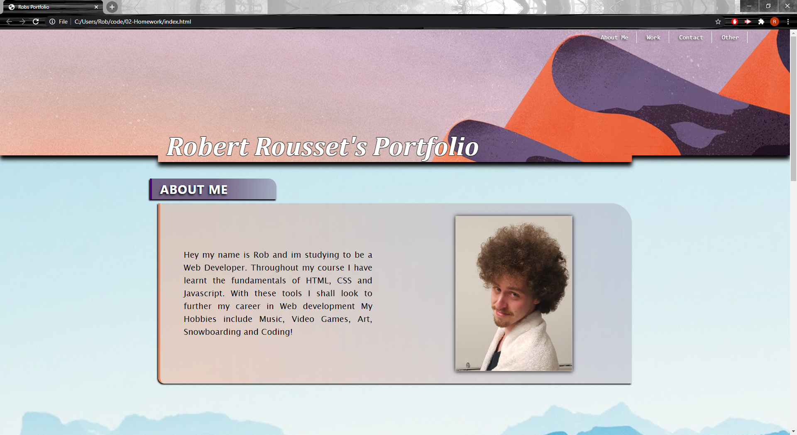

# 02 Advanced CSS: Portfolio

## Robs Portfolio ##

In this weeks homework we were told to create a portfolio (as a webpage) that displays all of our applications and projects. I have created and stylized the design to my liking while making sure to hit all the criteria set. In this project I have learnt how to position content and boxes to where I'd like. I have also learnt how to create a functional nav bar, and clickable pictures. I have added hover effects over the images to give colour on hover. I have made sure to add more comments in my CSS to make it easier to read and follow. 

Below is the link to my working application:

And a screenshot: 